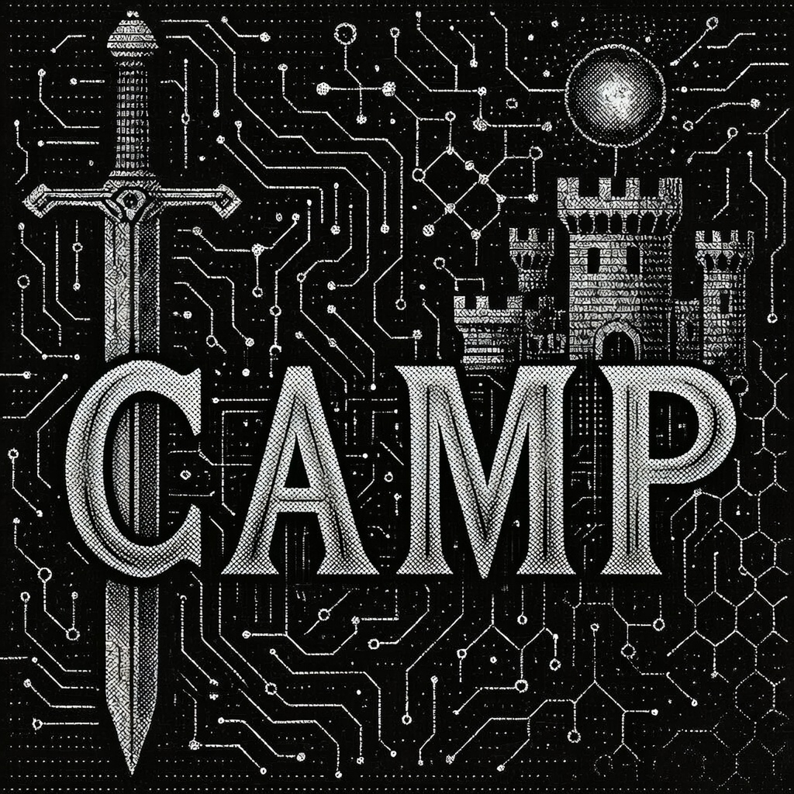

# camp

Campaign workspace manager for multi-project AI development.

## Features

- **Navigation** — Category shortcuts, fuzzy finding, bookmarks (`go`, `pin`, `shortcuts`)
- **Project Management** — Git submodules, worktrees, and project scaffolding (`project add/list/remove/new/worktree`)
- **Planning** — Intents, status flows, dungeon for deprioritized work (`intent`, `flow`, `dungeon`, `gather`)
- **Productivity** — Leverage scoring to identify high-impact work (`leverage`)
- **Git Integration** — Campaign-level git operations (`commit`, `log`, `push`, `status`)
- **Campaign Ops** — Health checks, file operations, cross-campaign tools (`doctor`, `copy`, `move`, `sync`)
- **Shell Integration** — Native cd behavior with zsh, bash, and fish (`shell-init`)
- **Tab Completion** — Smart completion for categories, projects, and paths

## Installation

### Go Install

```bash
go install github.com/obediencecorp/camp@latest
```

### From Source

```bash
git clone https://github.com/obediencecorp/camp
cd camp
just install
```

### Shell Integration

Add to your shell config to enable the `cgo` navigation function and tab completion:

**Zsh** (~/.zshrc):
```bash
eval "$(camp shell-init zsh)"
```

**Bash** (~/.bashrc):
```bash
eval "$(camp shell-init bash)"
```

**Fish** (~/.config/fish/config.fish):
```fish
camp shell-init fish | source
```

The eval hook provides:
- **`cgo` function** - Shell-native navigation with actual `cd` behavior
- **Tab completion** - Context-aware completion for categories, projects, and commands
- **`camp` completion** - Full command completion for the camp CLI

After adding the eval line, restart your shell or run `source ~/.zshrc` (or equivalent).

## Quick Start

```bash
# 1. Initialize a campaign
mkdir my-campaign && cd my-campaign
camp init

# 2. Add shell integration (restart shell after)
echo 'eval "$(camp shell-init zsh)"' >> ~/.zshrc

# 3. Navigate!
cgo p          # Jump to projects/
cgo f          # Jump to festivals/
cgo p api      # Fuzzy find "api" in projects/
```

## Category Shortcuts

Navigate instantly with single-letter shortcuts:

| Shortcut | Directory      | Description                |
|----------|----------------|----------------------------|
| `p`      | projects/      | Project subdirectories     |
| `c`      | corpus/        | Reference materials        |
| `f`      | festivals/     | Festival methodology       |
| `a`      | ai_docs/       | AI documentation           |
| `d`      | docs/          | Human documentation        |
| `w`      | worktrees/     | Git worktrees              |
| `r`      | code_reviews/  | Code review materials      |
| `pi`     | pipelines/     | CI/CD pipelines            |

## Commands

### Navigation — `cgo`

The `cgo` shell function is your primary interface:

```bash
# Jump to campaign root
cgo

# Jump to category
cgo p               # projects/
cgo f               # festivals/

# Fuzzy search within category
cgo p api           # projects/api-* (matches api-service, api-gateway, etc.)
cgo f fest          # festivals/*fest*

# Run command from category (without changing directory)
cgo -c p ls           # List contents of projects/
cgo -c f fest status  # Run fest status from festivals/
```

**Bookmarks**: Pin frequently visited directories for quick access:

```bash
camp pin             # Bookmark current directory
camp pins            # List all bookmarks
camp unpin           # Remove bookmark
```

**Shortcuts**: View all category shortcuts and custom shortcuts:

```bash
camp shortcuts       # List all available shortcuts
```

### Setup

```bash
camp init                  # Initialize current directory
camp init my-campaign      # Create and initialize new directory
camp clone <url>           # Clone a campaign with full submodule setup
```

### Project Management

```bash
camp project add <url>     # Add git submodule
camp project list          # List all projects
camp project remove <name> # Remove a project
camp project new <name>    # Create a new project
camp project worktree      # Manage git worktrees
camp project commit        # Commit within a project
```

### Planning

Intents, status flows, and the dungeon provide lightweight planning tools:

```bash
# Intents — capture ideas, goals, and work items
camp intent                # Manage campaign intents
camp gather                # Import external data into the intent system

# Flows — track work status
camp flow                  # Manage status workflows for organizing work

# Dungeon — archive deprioritized work
camp dungeon               # Move items to/from the dungeon
```

### Productivity

```bash
# Leverage scoring — identify high-impact work
camp leverage              # Compute leverage scores for campaign projects
```

See [docs/leverage-score.md](docs/leverage-score.md) for details on the scoring algorithm.

### Git Integration

Campaign-level git operations:

```bash
camp commit                # Commit changes in the campaign root
camp log                   # Show git log of the campaign
camp push                  # Push campaign changes to remote
camp status                # Show git status of the campaign
```

### Campaign Operations

```bash
camp doctor                # Diagnose and fix campaign health issues
camp sync                  # Safely synchronize submodules
camp copy                  # Copy a file or directory within the campaign
camp move                  # Move a file or directory within the campaign
camp run                   # Execute command from campaign root, or just recipe in a project
```

### Global Commands

```bash
camp list                  # List all registered campaigns
camp switch                # Switch to a different campaign
camp transfer              # Copy files between campaigns
camp register              # Register campaign in global registry
camp unregister            # Remove campaign from registry
```

### System

```bash
camp settings              # Manage camp configuration
camp date                  # Append date suffix to file or directory name
camp version               # Show version information
```

### Shell Integration

```bash
camp shell-init zsh       # Output zsh init script
camp shell-init bash      # Output bash init script
camp shell-init fish      # Output fish init script
```

#### How the Eval Hook Works

The eval hook dynamically generates and executes shell code at startup:

```bash
# What happens when you add this to ~/.zshrc:
eval "$(camp shell-init zsh)"

# 1. camp shell-init zsh outputs shell code (functions, completions)
# 2. eval executes that code in your current shell
# 3. The cgo function and completions become available
```

#### Why Eval Instead of Sourcing a File?

- **Version sync** - Always uses functions matching your installed camp version
- **No file management** - Nothing to update when camp is upgraded
- **Shell detection** - Camp can detect your shell environment dynamically

#### What Gets Installed

The shell-init script provides:

```bash
# 1. The cgo navigation function
cgo p                    # Runs: cd "$(camp go p --print)"
cgo p api                # Runs: cd "$(camp go p api --print)"
cgo -c p ls              # Runs: camp go p -c ls (no cd)

# 2. Tab completion for cgo
cgo <TAB>                # Completes categories: p c f a d w r pi
cgo p <TAB>              # Completes project names

# 3. Tab completion for camp commands
camp <TAB>               # Completes: init go project list register...
camp project <TAB>       # Completes: add list remove
```

#### Troubleshooting

```bash
# Verify camp is in PATH
which camp

# Test shell-init output
camp shell-init zsh

# Manually reload
source ~/.zshrc

# Check if cgo is defined
type cgo
```

## Campaign Directory Structure

A campaign provides a standardized layout for AI development:

```
my-campaign/
├── .campaign/           # Campaign configuration
│   └── campaign.yaml
├── projects/            # Git submodules
│   ├── api-service/
│   └── web-app/
├── festivals/           # Festival methodology
│   ├── planning/
│   ├── active/
│   ├── ready/
│   ├── ritual/
│   └── dungeon/         # completed/, archived/, someday/
├── ai_docs/             # AI documentation
├── docs/                # Human documentation
├── corpus/              # Reference materials
├── worktrees/           # Git worktrees
│   └── api-service/
│       ├── feature-x/
│       └── bugfix-y/
├── code_reviews/        # Review notes
└── pipelines/           # CI/CD configs
```

## Worktree Navigation

Navigate git worktrees with `@` syntax:

```bash
cgo w                     # List all worktrees
cgo w api-service@        # Show branches for api-service
cgo w api-service@feat    # Jump to api-service@feature-x
```

## Tab Completion

The shell integration includes intelligent tab completion:

```bash
cgo <TAB>           # Shows: p c f a d w r pi
cgo p <TAB>         # Shows: api-service web-app cli-tool
cgo p api<TAB>      # Completes to: api-service api-gateway
cgo w api@<TAB>     # Shows worktree branches
```

## Configuration

### Campaign Config

Located at `.campaign/campaign.yaml`:

```yaml
name: my-campaign
type: product
description: My awesome project
```

### Project Jump Locations

Projects can define shortcuts to jump directly to subdirectories within the project. The `default` shortcut is used when navigating to the project without specifying a sub-path.

Add a `projects` section to `.campaign/campaign.yaml`:

```yaml
projects:
  - name: festival-methodology
    path: projects/festival-methodology
    shortcuts:
      default: fest/           # Jump here by default
      cli: fest/cmd/fest/      # Named sub-shortcut

  - name: api-service
    path: projects/api-service
    shortcuts:
      default: src/
```

Usage:

```bash
cgo p fest       # Jumps to projects/festival-methodology/fest/ (uses default)
cgo p fest cli   # Jumps to projects/festival-methodology/fest/cmd/fest/
cgo p api        # Jumps to projects/api-service/src/ (uses default)
```

Without a `default` shortcut, navigation jumps to the project root.

### Global Config

Located at `~/.obey/campaign/config.yaml`:

```yaml
default_type: product
editor: code
```

## Documentation

Extended documentation is available in the `docs/` directory:

- [Leverage Scoring](docs/leverage-score.md) — How leverage scores are computed
- [Shortcuts](docs/SHORTCUTS.md) — Category shortcuts reference
- [Shell Integration](docs/shell-integration.md) — Detailed shell setup guide

## Development

```bash
just              # List all commands
just build        # Build camp binary
just test         # Run tests
just install      # Install locally
just run <args>   # Run with arguments
```

## License

Business Source License 1.1 - See [LICENSE](LICENSE) for details.
