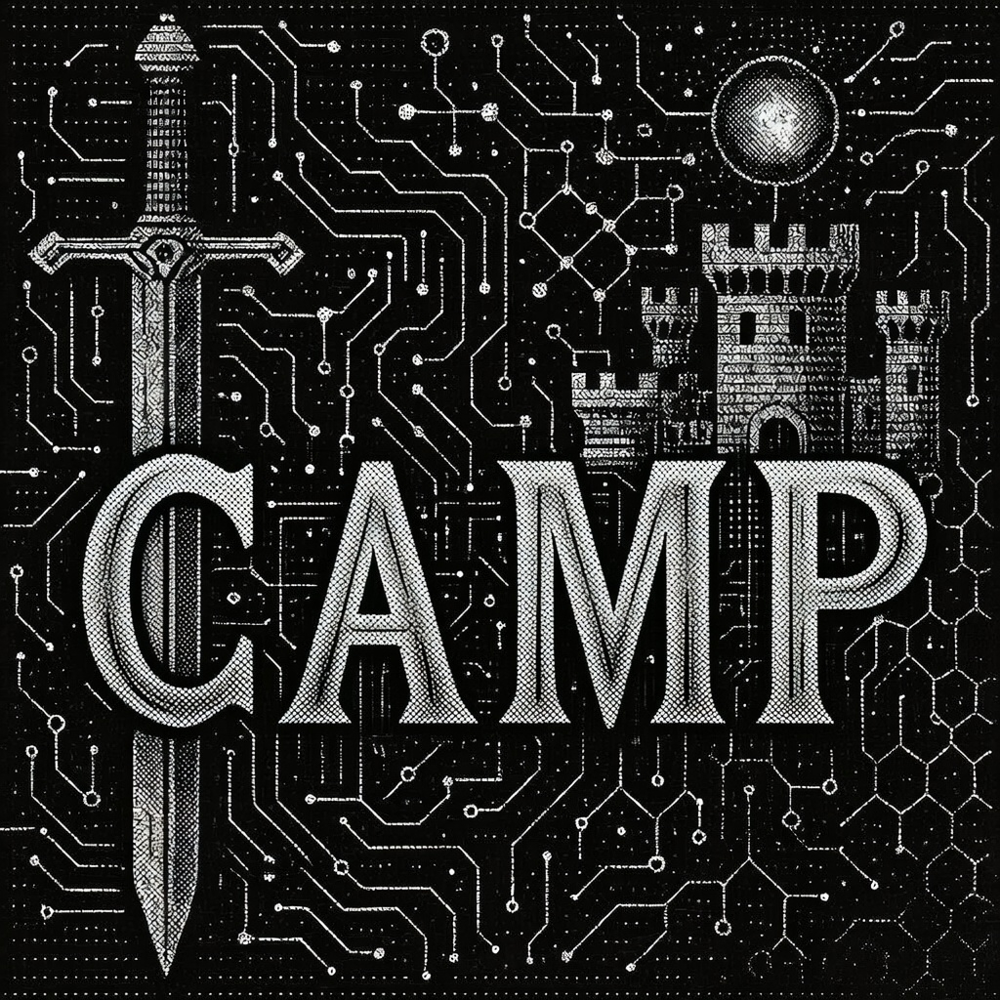
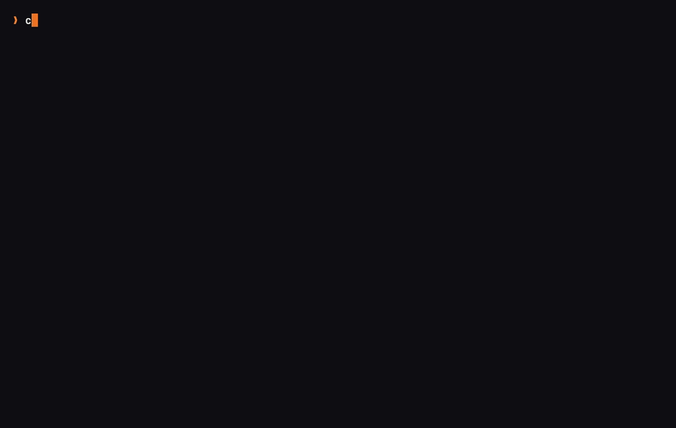

<p align="center">
  
</p>

# camp

<p align="center"><a href="https://github.com/Obedience-Corp/camp/stargazers"></a></p>

> **Easily manage hundreds of projects and millions of planning documents.** Part of [Festival](https://github.com/Obedience-Corp/festival). Camp handles the workspace: your projects, tools, ideas, and context. [fest](https://github.com/Obedience-Corp/fest) handles the planning and execution inside it.

Camp manages your camps. A camp is one context in your life: your job, a side project, your taxes. Each camp holds the projects you work on and hosts the festivals you run in them. Move between camps, projects, and workstations with your plans and context in reach.

<p align="center">
  
</p>
<p align="center"><em><code>cgo</code>: jump anywhere in the workspace with fuzzy matching, from any shell.</em></p>

<p align="center">
  
</p>
<p align="center"><em><code>camp wi</code>: one queue for every kind of work in the camp.</em></p>

Both demos run the current CLI against synthetic data. [Recording details](docs/images/demos/README.md).

## Installation

### Install Festival (recommended)

[Festival](https://github.com/Obedience-Corp/festival#readme) installs `camp`,
`fest`, and the `festival` manager together. Git is required.

**macOS with Homebrew:**

```bash
brew install --cask Obedience-Corp/tap/festival
```

**macOS or Linux with Node.js:**

```bash
npm install -g @obedience-corp/festival
```

Choose one method, then check the installation:

```bash
festival doctor
camp version
fest version
```

Use `festival update` to update the suite. See the
[installation guide](https://docs.fest.build/getting-started/installation/)
for Linux packages and WSL2.

### Install Camp with Go

```bash
go install github.com/Obedience-Corp/camp/cmd/camp@latest
```

### Build Camp from Source

```bash
git clone https://github.com/Obedience-Corp/camp
cd camp
just install stable
```

Building from source requires Go and [just](https://github.com/casey/just).
See [go.mod](go.mod) for the required Go version.

### Shell Integration

Add the matching line to your shell config to enable navigation and tab completion.
Load Fest’s integration too when you install the suite:

**Zsh** (~/.zshrc):

```bash
eval "$(camp shell-init zsh)"
eval "$(fest shell-init zsh)"  # Festival suite
```

**Bash** (~/.bashrc):

```bash
eval "$(camp shell-init bash)"
eval "$(fest shell-init bash)"  # Festival suite
```

**Fish** (~/.config/fish/config.fish):

```fish
camp shell-init fish | source
fest shell-init fish | source  # Festival suite
```

For other POSIX shells, use `eval "$(camp shell-init sh)"`; tab completion is
available in bash, zsh, and fish.

Restart your shell or reload its config, such as `source ~/.zshrc`. You can
then use `cgo` to change directories and Tab to complete paths and commands.

## Quick Start

After installing Festival and loading the shell integration above:

```bash
# Create a camp for one area of your work.
camp init my-camp -d "My first camp" -m "Build and ship my projects"
cd my-camp

# Link a project you already have (replace this with its local path).
camp project link /path/to/your-existing-repo

# Or clone a repository into the camp as a Git submodule.
# camp project add https://github.com/you/your-repo

cgo p          # Jump to projects/
cgo --root     # Return to the camp root
camp idea add "Try a simpler onboarding flow"
camp workitem  # Open the searchable work dashboard
```

`camp init` prompts for description and mission in a terminal when they are
omitted. `camp project link` lets you paste a path or browse folders, then
review the link before writing it. The project stays in its original location.

Use `cgo p <name>` to fuzzy-find a project and `cgo f` to reach the festival
workspace. Festival includes `fest`, which sets up the festival directories
during camp creation.

For a goal that needs a plan, open your coding agent at the camp root and ask it
to create a festival and run the `fest next` loop. See the
[Festival quick start](https://docs.fest.build/getting-started/quickstart/).

## Features

- **Navigation**: Category shortcuts, fuzzy finding, pins, and a cached index for instant project lookups (`go`, `pin`, `shortcuts`, `cache`)
- **Project Management**: Git submodules, linked local workspaces, camp-owned directories, worktrees, and scaffolding (`project add/link/list/new/rename/remote/remove/run/unlink/worktree/prune`)
- **Planning**: Ideas, notes, tracked work, triage, promotion, and portable festival bundles (`idea`, `workitem`, `triage`, `workflow`, `promote`, `dungeon`, `gather`, `pack`, `unbundle`)
- **Productivity**: Leverage scoring to identify high-impact work (`leverage`)
- **Git Integration**: Camp and project commits, deferred commit jobs, project status, and post-merge branch cycling (`stage`, `commit`, `jobs`, `log`, `push`, `pull`, `status`, `fresh`, `refs-sync`)
- **Camp Ops**: Health checks, attachments, artifact roots, and cross-camp or remote file transfers (`doctor`, `attach`, `artifacts`, `copy`, `move`, `sync`, `machine`, `transfer`)
- **Shell Integration**: Native `cd` behavior with zsh, bash, fish, and POSIX sh (`shell-init`)
- **Tab Completion**: Smart completion for categories, projects, and paths
- **Plugins**: Discover camp plugins on `PATH` (`plugins`)

## Category Shortcuts

Navigate with the default category shortcuts:

| Shortcut | Directory              | Description            |
|----------|------------------------|------------------------|
| `p`      | projects/              | Project subdirectories |
| `f`      | festivals/             | Festival methodology   |
| `w`      | workflow/              | Workflow directory     |
| `d`      | docs/                  | Human documentation    |
| `i`      | .campaign/intents/     | Ideas via `camp idea` |
| `settings`, `cfg` | .campaign/          | Camp settings directory |
| `wt`     | projects/worktrees/    | Git worktrees          |
| `du`     | dungeon/ (configurable) | Archived work |
| `r`      | workflow/reviews/      | Review materials       |
| `de`     | workflow/design/       | Design documents       |
| `ex`     | workflow/explore/      | Exploratory notes      |

Run `camp shortcuts` to see your camp’s paths. Customize them in
`.campaign/settings/jumps.yaml`; see the [shortcuts guide](docs/SHORTCUTS.md).

## Commands

### Navigation - `cgo`

The `cgo` shell function is your primary interface:

```bash
# Toggle between camp root and last location
cgo
cgo --root          # Always go to the root

# Jump to category
cgo p               # projects/
cgo f               # festivals/

# Fuzzy search within category
cgo p api           # projects/api-* (matches api-service, api-gateway, etc.)
cgo f fest          # festivals/*fest*

# Run command from category (without changing directory)
command camp go p -c ls                   # List contents of projects/
command camp go f -c fest -c status       # Run fest status from festivals/
```

**Pins**: Pin frequently visited directories, jump to them with `camp go` or `cgo`, then use toggle to bounce back:

```bash
camp pin code                               # Pin current directory
camp pin design workflow/design/my-project  # Pin a matching design directory
camp go code --print                        # Print the pinned path for scripts
cgo design                                  # Shell jump to a pin
cgo t                                       # Jump back to the previous location
camp pins                                   # List all pins
camp unpin design                           # Remove a pin
```

**Shortcuts**: View all category shortcuts and custom shortcuts:

```bash
camp shortcuts       # List all available shortcuts
```

### Setup

```bash
camp create <name>         # Create a new camp in the default camps directory
camp create <name> --path ~/Dev/sandbox  # Create under a specific camps directory
camp init                  # Initialize current directory
camp init my-camp          # Create and initialize new directory
camp clone <url>           # Clone a camp with full submodule setup
camp setup                 # One-time starter camp when no camps are registered
```

### Project Management

Most projects already live somewhere on your machine. Link that folder into
the camp. The folder stays where it is. Camp adds a shortcut under `projects/`
and a `.camp` attachment file in the folder.

```bash
camp project link               # Paste a path or browse, then confirm
camp project link <path>        # Review that folder, then link it
camp project link <path> --yes  # Link immediately
camp project add <url>          # Add a git submodule for a shared checkout
camp project rename             # Review the plan in the terminal, then rename
camp project rename old new     # Same rename; a terminal confirms before writing
```

In a terminal, `camp project link` asks for the project folder. From
that folder, Enter links it. From inside a camp, the camp is already
selected, so paste or type the project path, or move through the list.
Tab opens a folder. Then confirm before anything is written. `--yes`
and a shell without a terminal link immediately.

Use `camp project add` (or `camp p add`) when the checkout should travel with
the camp to another machine. A linked folder has to exist at the same path
on each machine.

For `camp project rename`, the terminal review shows the project, the new path, worktrees, and
metadata before anything is written. Piped output and `--yes` apply
immediately. `--json` stays scripted.

When an upstream repository was renamed too, pass the new URL explicitly:

```bash
camp project rename old new --remote-url git@github.com:org/new.git
```

Use `--dry-run` to preview the rename, including worktree paths, settings, and
work-item references.

For the rest of the project surface (`list`, `remove`, `unlink`, `stage`,
`commit`, `run`, `worktree`, `prune`, `remote`, `new`), see
[`docs/cli-reference/`](docs/cli-reference/).

### Attaching Reference Directories

Link notes, reference repositories, or scratch directories into a camp, then
use `camp attach` to make Camp commands available from inside them:

```bash
mkdir -p docs/examples
ln -s ~/Dev/external-repo docs/examples/external-repo
camp attach docs/examples/external-repo

cd docs/examples/external-repo
camp pin external-repo
cgo external-repo
```

See [`camp attach`](docs/cli-reference/camp_attach.md) for sharing a directory
across camps and [`camp detach`](docs/cli-reference/camp_detach.md) for removing
an attachment.

### Planning

Capture an idea, find work across the camp, and promote it when it is ready:

```bash
camp idea add "Make onboarding simpler"      # Save an idea to the inbox
camp idea explore                            # Browse ideas and notes
camp idea note "Decision from today's review" # Capture a note
camp idea notes --help                       # Note folders, moves, and meetings
camp gather                                  # Gather related work

camp workitem                                # Interactive dashboard (alias: camp wi)
camp workitem --list                          # Compact list for a noninteractive shell
camp workitem --json --type design            # Structured output for agents/scripts
camp workitem create onboarding --type feature --title "Simpler onboarding"

camp triage                                  # Review workitems in a recorded session
camp promote                                 # Promote the resolved idea/workitem/festival
camp dungeon                                 # Manage archived or deprioritized work
```

`camp workitem create` creates tracking metadata and a directory. Add the actual
plan or work content there. Use `camp workitem adopt` to track an existing
file or directory, and `camp workitem link` to connect work to projects,
worktrees, and festivals.

Use `camp workitem` for the interactive dashboard. For scripts, choose
`--json` for structured data, `--list` for a compact list, or `--print` for a path.

The dungeon triage crawl honors a `.crawlignore` file alongside the dungeon
directory. See [docs/crawlignore.md](docs/crawlignore.md) for syntax and
placement.

### Productivity

```bash
# Leverage scoring - identify high-impact work
camp leverage              # Compute leverage scores for the camp's projects
```

See [docs/leverage-score.md](docs/leverage-score.md) for details on the scoring algorithm.

### Git Integration

Git operations across the camp:

```bash
camp stage                 # Stage changes (same scope as commit) without committing
camp stage --include-refs  # Also stage submodule ref updates at the camp root
camp commit -m "Save context" # Capture camp-root changes (stages all by default)
camp p commit -m "Fix bug"   # Commit in the current project or worktree
camp log                   # Show git log of the camp
camp push                  # Push camp changes to remote
camp push all              # Push all submodules with unpushed changes
camp pull                  # Pull latest changes
camp pull all              # Pull all submodules
camp status                # Show git status of the camp
camp status all            # Dashboard of all submodules (branch, dirty/clean, push status, unmerged branches)
camp status all --view     # Interactive TUI viewer with per-repo detail
camp fresh --dry-run       # Preview the current project’s post-merge cycle
camp fresh                 # Fetch, sync default branch, prune merged branches
camp fresh -b feat/next    # Start a new branch after syncing
camp fresh configure      # Configure branch defaults and follow-up commands
camp fresh show-workflow  # Inspect the resolved sequence
camp fresh all             # Same cycle across every project in the camp
```

Use `camp refs-sync` to record project revision pointers in the camp. From a project,
`camp status --sub`, `camp pull --sub`, and `camp push --sub` target that project.
`camp jobs` inspects the deferred commit queue.

`camp fresh` preserves local-only commits while syncing. Configured follow-ups
(such as install or test commands) run after the cycle; use `--no-follow-up` to
skip them. Workitem completion handling is configured separately in
`.campaign/settings/fresh.yaml`.

### Camp Operations

```bash
camp doctor                # Diagnose and fix camp health issues
camp sync                  # Safely synchronize submodules
camp refs-sync             # Update the camp's recorded submodule pointers to each submodule's HEAD
camp copy                  # Copy a file or directory within the camp
camp move                  # Move a file or directory within the camp
camp run                   # Execute command from the camp root, or just recipe in a project
camp root                  # Print the current camp root
camp id                    # Print the current camp ID
camp concepts              # List configured concepts (picker/completion concepts)
camp cache info            # Show navigation cache status and metadata
camp cache rebuild         # Force rebuild the navigation cache
camp cache clear           # Delete the navigation cache
```

### Working Across Camps

```bash
camp list                  # List camps (active only by default; grouped by org)
camp list --org obey       # Filter by org; also --tag (AND), --status, --all, --group/--no-group
csw <name>                 # Switch camps through the shell helper
camp switch --help         # Camp picker and switching options
camp machine --help        # Remote machines and connection settings
camp transfer              # Copy files between camps
camp register              # Register a camp in the global registry
camp unregister            # Remove a camp from the registry
camp registry              # Maintain ~/.obey/campaign/registry.json (prune, sync, check)
```

### Organizing Camps (org / tags / lifecycle)

Camp records organization, tags, and lifecycle status in
`~/.obey/campaign/registry.json`:

- **org**: single membership; every camp is in exactly one org (default
  `default`). Group related camps; reassign by adding to a new org.
- **tags**: a single global pool of labels; a camp can carry any number,
  and the same tag crosses orgs freely.
- **status**: lifecycle, one of `active` / `inactive` / `reference`. The default
  `camp list` and `camp switch` surfaces show only `active`; use `--all` or
  `--status` to include inactive/reference camps. Set it with `camp lifecycle`.

```bash
camp org add obey c1 c2       # Assign camps to an org (also reassigns)
camp org remove c1            # Return camps to the default org
camp org rename obey obedience # Rename an org, reassigning all members atomically
camp org list                 # Orgs with member + active counts
camp org show obey            # Member camps of an org
camp org                      # Print the current camp's org

camp tag add c1 paid-work q3  # Add tags (set semantics; re-adding is a no-op)
camp tag rm c1 q3             # Remove tags
camp tag list                 # Global tag pool with counts

camp lifecycle set c1 reference  # Set status: active | inactive | reference
camp lifecycle list              # Status counts

camp festivals --org obey     # Festivals across an org's camps (composes 'fest list')
```

These commands accept `--json` for scripting. `camp festivals` lists festivals
across camps selected by org or tag.

### Skills

Camp keeps skill bundles in `.campaign/skills/` and links them into tool
directories such as `.claude/skills/` and `.agents/skills/`. Edit the shared
bundle once; each tool reads the same instructions.

```bash
camp skills                # Manage camp skill bundle projection (link/unlink/status)
```

### System

```bash
camp settings              # Manage camp configuration (interactive)
camp plugins               # List discovered camp plugins on PATH
camp date                  # Append date suffix to file or directory name
camp version               # Show version information
```

### Shell Helpers

The shell integration provides shortcuts for navigation, capture, and running
commands from the camp root:

```bash
cgo p api               # Jump to a matching project
csw <name>              # Switch camps
cr just build           # Run a command from the camp root
cint "new feature idea" # Capture an idea
cnote "meeting note"    # Capture a note
```

See the [shell integration guide](docs/shell-integration.md) for setup,
completion, and troubleshooting.

## Camp Directory Structure

Your projects, plans, and supporting documents live together:

```
my-camp/
├── .campaign/           # Camp configuration and system state
│   ├── campaign.yaml
│   ├── watchers.yaml
│   ├── intents/         # Captured ideas (camp idea, cgo i)
│   │   ├── inbox/
│   │   ├── active/
│   │   ├── ready/
│   │   └── .dungeon/
│   ├── workitems/       # Links between tracked work and its targets
│   ├── settings/        # Camp-local settings and defaults
│   ├── skills/          # Camp skill bundles (camp skills)
│   ├── leverage/        # Leverage snapshots and cache (camp leverage)
│   └── cache/           # Navigation index cache
├── projects/            # Git submodules and linked workspaces
│   ├── api-service/     # Git submodule
│   ├── web-app/         # Git submodule
│   ├── my-local-repo -> /Users/you/code/my-local-repo   # Linked workspace (symlink)
│   └── worktrees/       # Git worktrees (cgo wt)
│       └── api-service/
│           ├── feature-x/
│           └── bugfix-y/
├── festivals/           # Scaffolded by fest (cgo f)
│   ├── planning/
│   ├── active/
│   ├── ready/
│   ├── ritual/
│   ├── chains/
│   └── .dungeon/        # completed/, archived/, someday/
├── workflow/            # Workflow resources (cgo w)
│   ├── design/          # Design documents (cgo de)
│   ├── explore/         # Exploratory notes (cgo ex)
│   └── reviews/         # Review materials (cgo r)
├── docs/                # Human documentation (cgo d)
└── .dungeon/            # Archived work (cgo du)
```

## Worktree Navigation

Navigate git worktrees with `@` syntax:

```bash
cgo wt                    # Jump to worktrees/
cgo wt api-service@       # Show branches for api-service
cgo wt api-service@feat   # Jump to api-service@feature-x
```

## Tab Completion

The shell integration includes intelligent tab completion:

```bash
# Navigation
cgo <TAB>                              # Shows: p f w d i wt du r de ex settings cfg
cgo p <TAB>                            # Shows: api-service web-app cli-tool
cgo p api<TAB>                         # Completes to: api-service api-gateway
cgo wt api@<TAB>                       # Shows worktree branches

# --project flag (all project commands)
camp project commit -p <TAB>           # Shows project names from project list
camp project worktree add -p <TAB>     # Same project name completion
```

## Configuration

### Camp Config

Camp configuration lives in `.campaign/campaign.yaml`:

```yaml
name: my-camp
type: product
description: My awesome project
```

### Project Jump Locations

Projects can define shortcuts to jump directly to subdirectories within the project. The `default` shortcut is used when navigating to the project without specifying a sub-path.

Add a `projects` section to `.campaign/campaign.yaml`:

```yaml
projects:
- name: festival-methodology
  path: projects/festival-methodology
  shortcuts:
    default: fest/           # Jump here by default
    cli: fest/cmd/fest/      # Named sub-shortcut

- name: api-service
  path: projects/api-service
  shortcuts:
    default: src/
```

Usage:

```bash
cgo p fest       # Jumps to projects/festival-methodology/fest/ (uses default)
cgo p fest cli   # Jumps to projects/festival-methodology/fest/cmd/fest/
cgo p api        # Jumps to projects/api-service/src/ (uses default)
```

Without a `default` shortcut, navigation jumps to the project root.

### Config Files

Camp uses a small set of configuration and state files:

- `~/.obey/campaign/config.json`, Camp user configuration, for global
  preferences such as editor,
  theme, `no_color`, and `verbose`
- `.campaign/campaign.yaml` for camp metadata, project entries, and picker
  concepts
- `.campaign/settings/jumps.yaml` for camp-local navigation paths and
  shortcuts
- `.campaign/settings/fresh.yaml` for `camp fresh` defaults and follow-up commands
- `.campaign/watchers.yaml` for the camp/fest watcher contract

See [docs/campaign-settings-files.md](docs/campaign-settings-files.md) for the
full file-by-file reference, including which files are scaffolded by
`camp init` and which are only created on first use.

## Documentation

- [CLI Reference](docs/cli-reference/camp-reference.md): complete reference for every command and flag
- [`.campaign/` Directory Reference](docs/campaign-directory-reference.md): the hidden camp metadata layout and ownership
- [Camp Settings Files](docs/campaign-settings-files.md): global and local config/state files explained
- [Leverage Scoring](docs/leverage-score.md): how leverage scores are computed
- [Shortcuts](docs/SHORTCUTS.md): category shortcuts reference
- [Shell Integration](docs/shell-integration.md): detailed shell setup guide
- [`.crawlignore` Syntax](docs/crawlignore.md): excluding paths from dungeon triage

Migration guides for behavior changes live under [docs/migrations/](docs/migrations/).

Individual command docs are in [`docs/cli-reference/`](docs/cli-reference/) (auto-generated via `just docs`).

## Development

```bash
just                      # List all commands
just build-camp           # Build camp binary (vet + build)
just build                # Show all build recipes (profiles, cross-platform)
just test                 # Show all test recipes
just test all             # Run all tests
just install              # Show install options (stable, dev, current)
just install stable       # Install stable profile to $GOBIN
just gate-fast            # Run the local quality gate on demand
just docs                 # Regenerate CLI reference docs
just docs-check           # Fail if committed CLI reference is stale
just run <args>           # Run with arguments
```

### Quality Gate

Run the local quality gates before sharing a change:

```bash
just gate-push   # quick smoke: whitespace, build, vet, lint, short dev tests
just gate-fast   # broader: both-profile build, vet, lint, CLI docs check, full dev unit tests
just gate        # full matrix: gate-fast plus stable unit tests
```

Release recipes run `just gate` before tagging. When changing command help,
run `just docs` and include the regenerated CLI reference in the commit.

## Part of Festival

Camp is part of [Festival](https://github.com/Obedience-Corp/festival) by [Obedience Corp](https://github.com/Obedience-Corp).

- **camp**: workspace and context. One place for all your projects, tools, ideas, agents, and work.
- **[fest](https://github.com/Obedience-Corp/fest)**: planning and execution. Hierarchical: festival → phase → sequence → task.
- **[Festival](https://github.com/Obedience-Corp/festival)**: suite installer and updater for camp + fest. Full docs at [fest.build](https://fest.build).

<p align="center"><strong>Find camp useful?</strong> <a href="https://github.com/Obedience-Corp/camp">Star the repo</a> so others can find it.</p>

## License

Apache License 2.0 - See [LICENSE](LICENSE) for details.
