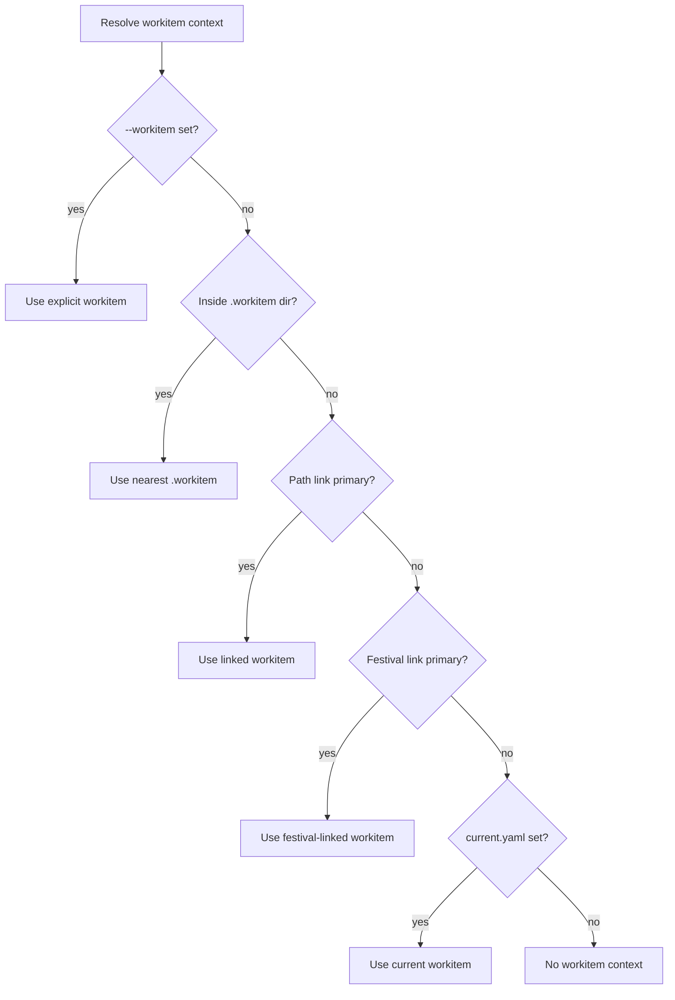

# Workitem link registry — schema

Sequence: `001_IMPLEMENT/02_workitem_link_registry`
Festival: `camp-workitem-linking-and-commits-CW0003`
Source design: [`workflow/design/workitem-linking-commit-tracking/02-workitem-linking-model.md`](../../../../workflow/design/workitem-linking-commit-tracking/02-workitem-linking-model.md)
Sibling implementation: [`projects/camp/internal/quest/link.go`](../../quest/link.go)

This document is the v1 contract for the workitem link registry. It freezes
the schemas, scope kinds, roles, resolution priority, safety bounds, and link
ID format before any production code is written. Subsequent tasks (02–08 of
this sequence) implement against this contract.

---

## 1. Files

| Path | Committed? | Purpose |
|---|---|---|
| `.campaign/workitems/links.yaml` | yes | Durable workitem-to-scope relationships. Schema in §2. |
| `.campaign/workitems/current.yaml` | **no — gitignored** | The user's locally selected active workitem. Schema in §3. |

Both files live under `.campaign/workitems/`. The directory is created on
first write by `camp workitem link` / `camp workitem current`. Pre-existing
campaigns without either file behave as "no links, no current"; see §10
(migration).

### 1.1 Gitignore policy for `current.yaml`

`current.yaml` carries the user's per-machine context selection — what they
were working on when they last ran `camp workitem current <id>`. Committing
it would force the entire team to share one active workitem, which is the
opposite of what the file is for. It must be gitignored.

Implementation: `camp init` writes a campaign-root `.gitignore` template.
Sequence-02 task 02 adds `.campaign/workitems/current.yaml` to that template
and runs a one-time migration on existing campaigns (append the line if
absent and the file does not already ignore it transitively).

The team can opt-in to sharing `current.yaml` by removing the line manually;
this is documented but not surfaced as a CLI flag.

---

## 2. `links.yaml` schema

```yaml
version: workitem-links/v1alpha1
links:
  - id: lnk_20260524_ab12cd
    workitem_id: design-camp-timeline-2026-05-19
    workitem_key: design:workflow/design/camp-timeline
    scope:
      kind: project
      path: projects/camp-timeline
    role: primary
    created_at: 2026-05-24T19:00:00Z
    created_by: camp_workitem_link
```

### 2.1 Top-level fields

| Field | Required | Type | Notes |
|---|---|---|---|
| `version` | yes | string literal `workitem-links/v1alpha1` | Schema version. Loader rejects unknown versions with a wrapped `camperrors.ErrInvalidInput`. Future versions migrate forward at load time. |
| `links` | yes | sequence of `Link` | May be empty (`[]`). Empty file with only `version` is valid and represents "no links". |

### 2.2 `Link` fields

| Field | Required | Type | Validation |
|---|---|---|---|
| `id` | yes | string, format `lnk_<yyyymmdd>_<6 lowercase hex>` | Globally unique per campaign. Generated at create time, never changed. See §4. |
| `workitem_id` | yes | string | Stable `.workitem` `id` field. Matched against existing workitems unless `--allow-missing`. Max 200 chars. |
| `workitem_key` | optional | string | Human-readable convenience key (e.g. `design:workflow/design/foo`). Derived at create time; not authoritative — `workitem_id` wins on mismatch. Loader recomputes from `workitem_id` if missing. |
| `scope` | yes | nested object | See §2.3. |
| `role` | yes | enum | One of `primary`, `related`, `blocked_by`, `supersedes`. See §6. |
| `created_at` | yes | RFC 3339 UTC timestamp | Set at create time. Stored as `time.Time` in Go. |
| `created_by` | yes | string | Free-form provenance. Default `camp_workitem_link` from CLI. Allowed chars: `[A-Za-z0-9_-]`, max 64. |

### 2.3 `scope` fields

| Field | Required | Type | Validation |
|---|---|---|---|
| `kind` | yes | enum | One of `project`, `repo`, `campaign_path`, `festival`, `worktree`. See §5. |
| `path` | yes | string | Campaign-relative path, forward-slash-normalized, no leading `/`. Validated via `quest.ValidateLinkPath` (campaign-root containment + target existence). Max 4096 chars. |

The `scope` object is the unique key for primary-link collision detection.
`(scope.kind, scope.path, role=primary)` may exist at most once per campaign;
duplicates are rejected unless `--replace`. Non-primary roles (`related`,
`blocked_by`, `supersedes`) have no uniqueness constraint.

### 2.4 Sort order on disk

Links are written in stable order: ascending `scope.kind`, then ascending
`scope.path`, then ascending `created_at`. This keeps diffs minimal under
churn and makes review predictable. Loader does not require this order; it
is enforced only by the writer.

---

## 3. `current.yaml` schema

```yaml
version: workitem-current/v1alpha1
workitem_id: design-camp-timeline-2026-05-19
selected_at: 2026-05-24T19:30:00Z
```

| Field | Required | Type | Validation |
|---|---|---|---|
| `version` | yes | string literal `workitem-current/v1alpha1` | Schema version. |
| `workitem_id` | yes | string | Same validation as `links[].workitem_id`. Cleared by `camp workitem current --clear`, which deletes the file. |
| `selected_at` | yes | RFC 3339 UTC timestamp | Set on every write. |

`current.yaml` is a single document, not a list. Setting a new current
overwrites the file atomically (write-temp + rename). Clearing removes it.

The file is intentionally small and self-contained so a stale or
half-written copy is easy to spot and recover from manually.

---

## 4. Link ID format

```
lnk_<yyyymmdd>_<6 lowercase hex>
```

- `yyyymmdd` is the UTC date the link was created.
- `<6 lowercase hex>` is 24 bits of `crypto/rand`-sourced randomness.
- Regex: `^lnk_[0-9]{8}_[0-9a-f]{6}$` (exactly 22 characters).

Rationale:

- The date prefix is human-scannable in YAML and survives sorting.
- 24 bits of randomness is ample for the per-day collision domain (~16M
  values per day) and keeps IDs short.
- The `lnk_` prefix is reserved for this kind; collisions with workitem
  `id`s (no prefix or `<type>-<slug>-<date>` form) and quest `id`s
  (`qst_<...>`) are impossible.

Collision handling: on `crypto/rand` collision (single-process, after retry
loop of up to 32 attempts) the create call returns
`camperrors.NewValidation("id", ...)` — same shape as the workitem create
collision-retry path in `internal/commands/workitem/create.go`.

---

## 5. Scope kinds

| Kind | Path resolves to | Example |
|---|---|---|
| `project` | Campaign project or submodule path under `projects/` | `projects/camp-timeline` |
| `repo` | A git repository root that may not be registered as a project | `vendor/external-repo` |
| `campaign_path` | Any path under the campaign root that does not fit a more specific kind | `workflow/design/timeline-spike` |
| `festival` | A festival path under `festivals/active/`, `festivals/ready/`, etc. | `festivals/active/camp-timeline-CT0001` |
| `worktree` | A project worktree path under `projects/worktrees/` | `projects/worktrees/camp@feat-x` |

Kind validation:

- Loader rejects unknown kinds with `camperrors.ErrInvalidInput`.
- Writer normalizes `path` to forward slashes and strips trailing `/`.
- Kind detection from a raw path (for CLI ergonomics like `camp workitem
  link <id> --cwd`) reuses the rules embedded in
  `quest.DetectLinkType` where they overlap, with workitem-specific
  extensions for `worktree` (under `projects/worktrees/`) and the
  catch-all `campaign_path`. The detection logic lives in
  `internal/workitem/links/scope.go` — `quest.DetectLinkType` is not
  modified, since it returns the quest type vocabulary, not the workitem
  scope vocabulary.

Kind-to-path constraints (enforced at create time):

| Kind | Required path prefix | Notes |
|---|---|---|
| `project` | `projects/` | Must not be under `projects/worktrees/`. |
| `worktree` | `projects/worktrees/` | |
| `festival` | `festivals/` | |
| `repo` | (none) | Must contain a `.git/` directory or file. |
| `campaign_path` | (none) | Catch-all; rejected if it matches a more specific kind unless `--force-kind`. |

---

## 6. Roles

| Role | Routing meaning | Uniqueness |
|---|---|---|
| `primary` | The active workitem for `(scope.kind, scope.path)`. Commit wrappers pick this up. | At most one per scope. |
| `related` | Context only. Visible in `camp workitem links`. Not auto-selected for commits. | Unlimited per scope. |
| `blocked_by` | Pure metadata. May influence future doctor/sync checks. | Unlimited. |
| `supersedes` | Pure metadata. Lets a newer workitem claim an older one's history. | Unlimited. |

Role transitions: there is no explicit transition API in v1. To change a
link's role, callers remove and re-add. This keeps the data model
append-mostly and predictable for review.

---

## 7. Resolution priority

Commit wrappers and `camp workitem resolve` use this deterministic order
(first match wins):

1. Explicit `--workitem` flag.
2. Nearest ancestor directory containing a `.workitem` marker file.
3. `primary` link from `links.yaml` whose `scope.path` is the longest
   prefix of the current working directory (campaign-relative).
4. `primary` link whose `scope.kind` is `festival` and whose path is the
   active festival (when `fest link --show` resolves a festival).
5. `current.yaml`'s `workitem_id`.
6. No workitem context — commit wrappers proceed without a workitem tag.



Notes:

- "Longest prefix" at step 3 lets a deep path link (e.g.
  `projects/camp-timeline/internal/api`) win over a shorter sibling link
  (`projects/camp-timeline`) when both exist.
- Step 4 reuses the `fest link --show` resolver — workitem links do not
  reimplement festival detection.
- Resolution is read-only. It never mutates `current.yaml` even if a higher
  priority resolves; the local current selection persists across cwd
  changes by design.

---

## 8. Safety bounds

| Check | When enforced | Failure mode |
|---|---|---|
| Campaign-root containment for `scope.path` | Create + load | `camperrors.ErrInvalidInput` via `quest.ValidateLinkPath` |
| Target exists for `scope.path` | Create | `camperrors.ErrNotFound` via `quest.ValidateLinkPath`. Skipped under `--allow-missing` for migrations. |
| Workitem exists with `workitem_id` | Create | `camperrors.ErrNotFound`. Skipped under `--allow-missing`. |
| Duplicate `(scope.kind, scope.path, role=primary)` | Create | `camperrors.NewValidation("scope", ...)`. Overridable with `--replace`. |
| `version` field present and known | Load | Returns wrapped `camperrors.ErrInvalidInput`; loader does not silently coerce. |
| `id` matches `^lnk_[0-9]{8}_[0-9a-f]{6}$` | Load + create | `camperrors.NewValidation("id", ...)`. |
| Rename/move preservation | N/A (built-in) | Links key on `workitem_id` (the stable id). Moving the workitem directory does not change `id`, so links survive. `camp workitem doctor` detects orphaned `id`s (no matching `.workitem` on disk) and reports a finding. |

### 8.1 Atomicity

`links.yaml` writes use write-temp-plus-rename (the same pattern as
`internal/commands/workitem/create.go::atomicWriteFile`). Readers always
see either the old or the new full file; never a partial.

`current.yaml` follows the same pattern.

### 8.2 Concurrent writes

v1 does not lock `links.yaml`. Two concurrent `camp workitem link`
invocations could last-writer-wins. This matches every other YAML config
file in the repo (`.campaign/campaign.yaml`, `.campaign/settings/jumps.yaml`)
and is acceptable for the workitem use case (single-user CLI).
Documenting the limitation here so it does not surprise reviewers.

---

## 9. Validation rule table

Single table the implementation tests against. Each row is one assertion in
`internal/workitem/links/validation_test.go` (sequence-02 task 02).

| Field | Rule |
|---|---|
| `version` | Must equal `workitem-links/v1alpha1`. Missing or unknown → reject. |
| `links` | May be empty. Each element validated per below. |
| `links[].id` | Required, matches `^lnk_[0-9]{8}_[0-9a-f]{6}$`, unique within the file. |
| `links[].workitem_id` | Required, 1–200 chars, validated via `pathsafe.ValidateSegment` (same slug-safe rules as `.workitem` ids). |
| `links[].workitem_key` | Optional, no validation; loader recomputes if absent. |
| `links[].scope.kind` | Required, one of the §5 enum values. |
| `links[].scope.path` | Required, 1–4096 chars, no leading `/`, no `..`, passes `quest.ValidateLinkPath`, satisfies kind-prefix table in §5. |
| `links[].role` | Required, one of `primary`, `related`, `blocked_by`, `supersedes`. |
| `links[].created_at` | Required, RFC 3339 UTC, not in the future (>5min skew → warn, not reject; >24h skew → reject). |
| `links[].created_by` | Required, matches `^[A-Za-z0-9_-]{1,64}$`. |
| `current.version` | Must equal `workitem-current/v1alpha1`. |
| `current.workitem_id` | Required, same rules as `links[].workitem_id`. |
| `current.selected_at` | Required, RFC 3339 UTC, same skew tolerance as `created_at`. |

Validation errors return wrapped `camperrors.NewValidation` so the CLI
surfaces a field name and a one-line message. No `fmt.Errorf`.

---

## 10. Migration

Pre-existing campaigns have no `.campaign/workitems/` directory at all.
This must continue to work end-to-end:

1. `camp workitem resolve` returns "no workitem context" (resolution step 6)
   instead of erroring on the missing files.
2. `camp workitem links` prints "no links" and exits 0.
3. `camp workitem doctor` does **not** flag missing `links.yaml` or
   `current.yaml` as findings. Missing files are the documented zero state,
   not a problem.
4. The first `camp workitem link` creates the directory via `os.MkdirAll`.

No automatic file creation at campaign-init time. The directory only
appears once the user explicitly creates a link or sets a current.

---

## 11. Quest cross-reference

Workitem links and quest links share the campaign-root containment validator
but are otherwise separate first-class registries:

| Concern | Quest links | Workitem links |
|---|---|---|
| File | `.campaign/quests/<dir>/quest.yaml` | `.campaign/workitems/links.yaml` |
| Owner package | `internal/quest/` | `internal/workitem/links/` (new) |
| Shape | `{Path, Type, AddedAt}` | `{ID, WorkitemID, Scope{Kind, Path}, Role, CreatedAt, CreatedBy}` |
| Add/remove API | `quest.AddLink/RemoveLink` (operate on `Quest`) | `links.Add/Remove` (operate on `Links`, defined in task 02) |
| Path validator | `quest.ValidateLinkPath` | **same** — reused directly |
| Type detection | `quest.DetectLinkType` | Workitem-specific — see §5 |

`internal/quest/link.go` is **not** modified by this sequence. The workitem
link package imports `quest.ValidateLinkPath` and uses it as-is.

### 11.1 `quest_id` on `.workitem`

Sequence 03 task 01 adds an optional `quest_id` field to the `.workitem`
schema at version `v1alpha6`. The flow:

- At workitem create/adopt time, `camp` calls `quest.Service.ResolveContext`.
- If a quest resolves, its `id` is written into `.workitem.quest_id`.
- If no quest resolves, the field is omitted (legacy workitems remain
  byte-identical).

The link registry itself does not carry `quest_id`. It belongs on the
workitem, not the link, because a workitem has one quest at most while a
workitem can have many links.

---

## 12. Examples

Full examples live at `testdata/`:

- [`testdata/example_links.yaml`](testdata/example_links.yaml) — every
  scope kind and role represented.
- [`testdata/example_current.yaml`](testdata/example_current.yaml) — a
  populated `current.yaml`.

These fixtures are loaded by the unit tests in task 02 to assert the
loader-writer round-trip.

---

## 13. Open questions (out of scope, tracked here)

1. **Stable cross-machine `created_by` identity.** Currently `created_by`
   is a free-form provenance string. If the team wants per-user audit
   later, we will need to plumb a real identity source (`git config
   user.email`?) and define normalization rules. v1 leaves this as
   free-form on purpose.
2. **Link expiration.** No `expires_at` field in v1. Doctor handles
   orphaned-by-deletion via the missing-`.workitem` check. If teams want
   time-based expiry, add it at v1beta1.
3. **Quest-link auto-mirror.** Whether creating a workitem link should
   also create a quest link (or vice-versa) is deliberately not specified
   in v1. The two registries stay independent; cross-references happen
   only via `.workitem.quest_id` (§11.1) and the commit-tag composition
   in sequence 03.
